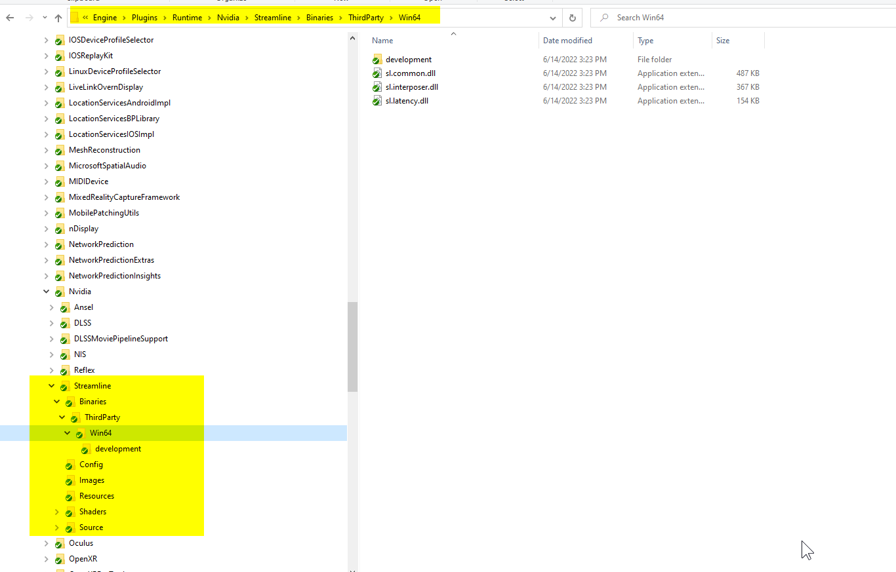
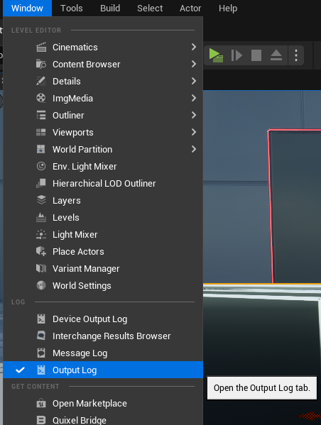
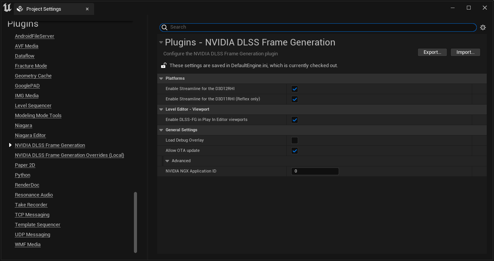
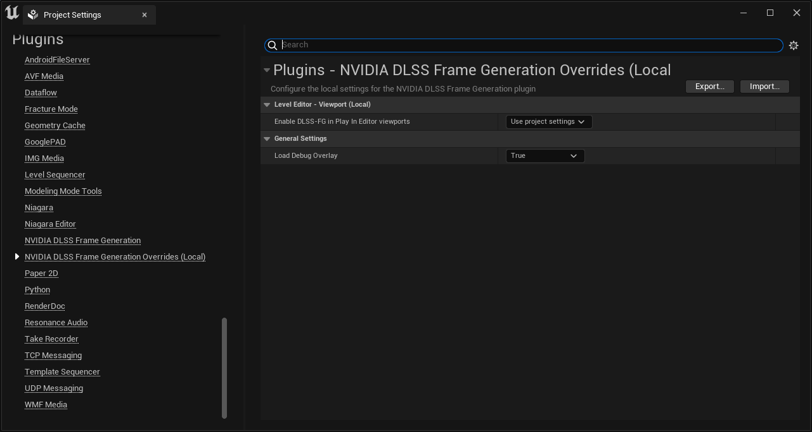
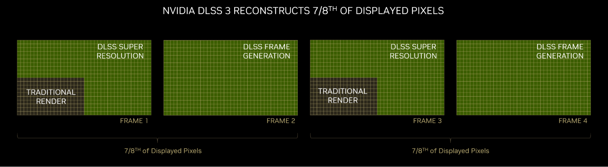

# NVIDIA Unreal Engine DLSS Frame Generation Plugin (Streamline)

## DLSS3 and the NVIDIA Unreal Engine DLSS Frame Generation Plugin

The NVIDIA *DLSS Frame Generation* plugin is part of a wider suite of related NVIDIA performance and image quality improving technologies and corresponding NVIDIA Unreal Engine plugins:

- NVIDIA *Deep Learning Supersampling Frame Generation (DLSS-FG)* boosts frame rates by using AI to render additional frames. *DLSS-FG* requires a Geforce RTX 40 series graphics card.
- NVIDIA *Deep Learning Supersampling Super Resolution (DLSS-SR)* boosts frame rates by rendering fewer pixels and using AI to output high resolution frames. *DLSS-SR* requires an NVIDIA RTX graphics card.
- NVIDIA *Deep Learning Anti-Aliasing (DLAA)* is used to improve image quality. *DLAA* requires an NVIDIA RTX graphics card.
- NVIDIA *Image Scaling (NIS)* provides best-in class upscaling and sharpening for non-RTX GPUs, both NVIDIA or 3rd party. Please refer to the NVIDIA *Image Scaling* Unreal Engine plugin for further details.
NVIDIA DLSS 3 combines DLSS Super Resolution, DLSS Frame Generation, and NVIDIA Reflex.

The NVIDIA Unreal Engine DLSS Frame Generation plugin (documented here) provides:

- DLSS Frame Generation (also called DLSS-G or DLSS-FG)
- NVIDIA Reflex

The NVIDIA Unreal Engine DLSS-SR plugin (available separately) provides:

- DLSS Super Resolution (DLSS-SR)
- Deep Learning Anti-Aliasing (DLAA)

The NVIDIA Unreal Engine NIS plugin (available separately) provides:

- NVIDIA Image Scaling

## Integration recommendation

The DLSS Frame Generation plugin is supported "out of the box" by Unreal Engine 5.2, including packaged engine releases from Epic.

For 5.1 and earlier engine releases, additional source changes to the engine itself must be made to support the DLSS Frame Generation plugin.  We recommend that the integration is done by an engineer who has some understanding of rebuilding Unreal Engine from source code as well as merging code snippets into the engine code itself.

# Quickstart DLSS3 Frame Generation

Note: DLSS Frame Generation and the Reflex implementation are provided together through a "Streamline" library, so the plugin's name is Streamline.

## UE 5.2

1. Copy the entire Streamline plugin folder somewhere under the engine's Plugins\Marketplace folder or under your source project's Plugins folder
   - For a packaged engine release from Epic, copy the plugin somewhere under the engine's Engine\Plugins\Marketplace folder
   - For a source engine build, copy the plugin somewhere under the engine's Engine\Plugins\Runtime folder
   - If you have a source project (not a blueprint-only project) you may also copy the plugin under your project's Plugins folder instead of the engine. Only one copy of the plugin is allowed so don't copy it to both locations
2. Enable the DLSS Frame Generation plugin in the Editor (Edit -> Plugins)
3. Restart the editor
4. Check the log for `NVIDIA Streamline supported 1`

## UE 5.1 and earlier

0. Merge custom engine changes with custom plugin hooks into your source tree, matching your UE version:
   1. <https://github.com/NvRTX/UnrealEngine/tree/streamline-2/sl2-5.1-engine-changes>
   2. <https://github.com/NvRTX/UnrealEngine/tree/streamline-2/sl2-5.0-engine-changes>
   3. <https://github.com/NvRTX/UnrealEngine/tree/streamline-2/sl2-4.27-engine-changes>
1. Copy the entire Streamline plugin folder somewhere under the engine's Engine\Plugins\Runtime folder or under your source project's Plugins folder
   - Only one copy of the plugin is allowed so don't copy it to both locations
2. Enable the DLSS Frame Generation plugin in the Editor
3. Restart the editor
4. Check the log for `NVIDIA Streamline supported 1`

## System requirements for DLSS Frame Generation

- Minimum Windows OS version of Win10 20H1 (version 2004, build 19041 or higher), 64-bit
- Display Hardware-accelerated GPU Scheduling (HWS) must be enabled via Settings : System : Display : Graphics : Change default graphics settings. <https://devblogs.microsoft.com/directx/hardware-accelerated-gpu-scheduling/>
- NVIDIA Ada architecture GPU (GeForce RTX 40 series, NVIDIA RTX 6000 series)
- NVIDIA Geforce Driver
  - Recommended: version 531.18 or higher
- UE project using DirectX 12 (Default RHI in project settings)

## Merging and Integrating Custom Engine Changes to support the DLSS Frame Generation plugin

### Unreal Engine 5.1

1. Apply required engine-side changes from this repository using either of the two methods
   1. Merge this branch directly if your code tree is git based <https://github.com/NvRTX/UnrealEngine/tree/streamline-2/sl2-5.1-engine-changes>
   2. Or alternatively download a patch file by this link: <https://github.com/EpicGames/UnrealEngine/compare/release...NvRTX:streamline-2/sl2-5.1-engine-changes.patch>
      1. Check that the patch file is compatible with your engine version by running the next command: git apply --check release...NvRTX:streamline-2/sl2-5.1-engine-changes.patch
      2. This operation is non-destructive and is purely a test to make sure that the merge is possible and flag any issues.
      3. In case of any issues, check the files that are being merged. This may happen when the touched files may have been modified by the developer themselves and the git merge test fails.
      4. Apply the patch with the next command: git apply release...NvRTX:streamline-2/sl2-5.1-engine-changes.patch
2. Place the Streamline.uplugin file and associated files (matching your UE version) into the following folder: `Engine/Plugins/Runtime/Nvidia/Streamline` like this:
3. Rebuild the patched engine version and your application.
4. Enable the DLSS Frame Generation plugin in the Editor.
   1. Go to the Plugins browser.
   2. Scroll all the way down until you find the plugin.
5. Restart the editor.
6. Validating the DLSS Frame Generation integration in UE
   1. Run the editor or game.
   2. Check debug output and/or the logs in `$(Project Name)/Saved/Logs` and look for the following line: `NVIDIA Streamline supported 1`
7. If any issues persist, do not hesitate to contact your NVIDIA representative.

The UE DLSS Frame Generation plugin itself is the same for other UE versions, but there are different branches/patches on Github with engine changes for each respective UE version:

### UE 5.0

Similar to 5.1 instructions

- Branch
  - <https://github.com/NvRTX/UnrealEngine/tree/streamline-2/sl2-5.0-engine-changes>
- Patch
  - [https://github.com/EpicGames/UnrealEngine/compare/release...NvRTX:streamline-2/sl2-5.0-engine-changes.patch](https://github.com/EpicGames/UnrealEngine/compare/release...NvRTX:streamline-2/sl2-5.0-engine-changes.patch)

### UE 4.27

Similar to 5.1 instructions

- Branch
  - <https://github.com/NvRTX/UnrealEngine/tree/streamline-2/sl2-4.27-engine-changes>
- Patch
  - [https://github.com/EpicGames/UnrealEngine/compare/release...NvRTX:streamline-2/sl2-4.27-engine-changes.patch](https://github.com/EpicGames/UnrealEngine/compare/release...NvRTX:streamline-2/sl2-4.27-engine-changes.patch)

# Troubleshooting

## Quick tips

1. How to find out which version of DirectX you are using:  Open the Output Log in Unreal Editor.  Search "RHI" to confirm which version of DirectX you are using.  You will see something like "LogD3D12" if it is DX12, for example.
2. How to confirm that Frame Generation initialized correctly:  Use the Output Log and search for Streamline, if the initialization succeeded or failed you should see that confirmed here.
3. How to find out which version of Windows you have:  Click the Start or Windows button (usually in the lower-left corner of your computer screen). Click Settings. Click System. Click About (usually in the lower left of the screen). The resulting screen shows the edition of Windows.

## Known issues

DLSS Frame Generation

- possibility of "device removed" error when enabling DLSS-FG, if SER (Shader Execution Reordering) is active at the same time. Recommend at least driver 531.18 to reduce likelihood of this issue occurring

Debug overlay

- overlay shows Ctrl-Shift-Home, Ctrl-Shift-Insert, Ctrl-Shift-Del keyboard commands that may not be functional

## Diagnosing plugin issues in the Editor

The UE DLSS Frame Generation plugin modules write various information into the following UE log categories:

- LogStreamline
- LogStreamlineAPI
- LogStreamlineBlueprint
- LogStreamlineD3D11RHI
- LogStreamlineD3D12RHI
- LogStreamlineRHI
- LogStreamlineRHIPreInit

Those can be accessed in the Editor under `Window -> Output Log`.

The Message log then can be filtered to show only the Streamline related messages to get more information on why the plugin might not be functioning as expected.

## Debug overlay

In non Shipping builds, the DLSS Frame Generation plugin can show a debug overlay that displays runtime information. The overlay can be enabled/disabled in non Shipping builds with the `Plugins -> NVIDIA DLSS Frame Generation -> Load Debug Overlay` option in Project Settings. The overlay is only supported on systems where the DLSS-FG feature is supported.

## Frame rate limiting

Due to how Unreal Engine handles frame rate limiting, there may be issues where the frame rate gets stuck at the minimum frame rate and doesn't recover. The console variable `t.Streamline.Reflex.HandleMaxTickRate` can be set to `False` to let the engine limit the max tick rate instead of Streamline Reflex, which may help these situations. The engine is unaware of DLSS frame generation, so the actual graphics frame rate may be effectively double what the engine's max FPS is set to when this cvar is `False`.

## Content Considerations

### Correct rendering of UI alpha

DLSS-FG can make use of a UI color and alpha buffer to increase image quality of composited UI. The UE DLSS Frame Generation plugin generates this from the backbuffer by extracting the alpha channel after UI has been rendered (right before present).

UE by default does not clear alpha of the scenecolor, which works fine since most, if not all UMG material blending modes only consider incoming alpha and write all pixels. However the developer console window gets rendered after the UI elements, writing to the alpha channel. This alpha persist across frames and will result in incorrect UI color ands alpha buffer being generated by the UE Streamline plugin and then passed into Streamline/DLSS-G.

The engine does not provide a built-in way to clear just the alpha of the scenecolor. Thus the UE Streamline plugin adds a renderpass to clear the alpha channel of the scene color at the end of postprocessing, before UI elements get rendered. This is controlled by `r.Streamline.ClearSceneColorAlpha`, which is true by default.

Note: UI color alpha support is only supported in standaline game windows. In Editor PIE popup windows UI color and alpha tagging disabled by default (see `r.Streamline.Editor.TagUIColorAlpha` ) since clearing the alpha channel is not trivial: PIE windows render the scene into a separate 'BufferedRT' render target, blit that into the backbuffer and then draw UI on top of that before presenting. This 'BufferedRT' intermediate step prevents `r.Streamline.ClearSceneColorAlpha` from working as intented. As such image quality in the PIE editor windows is not representative, however should be sufficient to develop UI and settings logic using the blueprint library.

This however only works if the application renders UI in the expected way, which means any UI element needs to write alpha into the backbuffer (regardless of whether it's opaque or transparent). In practice this means:

- Don't use  `UWidgetBlueprintLibrary::DrawText` to draw UI text since that does *not* write alpha.
- Do use UMG widgets instead since those correctly write alpha into the backbuffer with an appropriate blending mode

# Plugin configuration

Some project settings are split across two config files, with the possibility of a local override.

- `Project Settings -> Plugins -> NVIDIA DLSS Frame Generation`
  - stored in DefaultEngine.ini
  - typically resides in source control.
  - settings here are shared between users
- `Project Settings -> Plugins -> NVIDIA DLSS Frame Generation Overrides (Local)`
  - stored UserEngine.ini
  - not recommended to be checked into source control.
  - allow a user to override project wide settings if desired. Defaults to "Use project settings"

# Command Line Options And Console Variables and Commands

**Note**: UE DLSS Frame Generation plugin modules are loaded very early during engine startup, before console variables are available. As such, various debugging settings are exposed via command line options instead of console variables.

## Selecting Streamline binary flavor

By default Streamline uses signed production binaries (e.g. `sl.interposer.dll`, `sl.common.dll`) from the `Streamline\Binaries\ThirdParty\Win64\` path.

For non shipping UE builds, alternate binaries can be selected via `-slbinaries={development,debug}` command line argument,  corresponding to the `Streamline\Binaries\ThirdParty\Win64\Development` and `Streamline\Binaries\ThirdParty\Win64\Debug` paths respectively.

## Logging

By default Streamline uses `sl:eLogLevelDefault`. This can be changed with the `-slloglevel={0,1,2}`command line argument, corresponding to `sl::eLogLevelOff`,  `sl::eLogLevelDefault`,  `sl::eLogLevelVerbose` respectively

By default the Streamline console window is turned off. This can be changed wit the `-sllogconsole={0,1}` command line argument.

## DLSS Frame Generation generic settings

The DLSS Frame Generation plugin uses various engine side hooks, which can be configured by the following cvars. Their default values

- r.Streamline.ViewIdOverride
  - 0: use ViewState.UniqueID
  - 1: on set view ID to 0 (default)
- r.Streamline.TagSceneColorWithoutHUD
  - Pass scene color without HUD into DLSS Frame Generation (default = true)
- r.Streamline.ClearSceneColorAlpha  
 - Clear alpha of scenecolor at the end of the Streamline view extension to allow subsequent UI drawcalls be represented correctly in the alpha channel  (default=true)
- r.Streamline.Editor.TagUIColorAlpha
 - Experimental: Pass UI color and alpha into Streamline in Editor PIE windows (default = false)
 
 
## Finetuning motion vectors for DLSS Frame Generation
  
DLSS Frame Generation requires correct motion vectors to function properly. The following console variable can be used to tweak values during game development

- r.Streamline.DilateMotionVectors
  - 0: pass low resolution motion vectors into DLSS Frame Generation (default)
  - 1: pass dilated high resolution motion vectors into DLSS Frame Generatio. This can help with improving image quality of thin details.

- r.Streamline.MotionVectorScale
  - Scale DLSS Frame Generation motion vectors by this constant, in addition to the scale by 1/ the view rect size. (default = 1.0)

## Finetuning depth for DLSS Frame Generation

- r.Streamline.CustomCameraNearPlane
  - Custom distance to camera near plane. Used for internal DLSS Frame Generation purposes, does not need to match corresponding value used by engine. (default = 0.01)
- r.Streamline.CustomCameraFarPlane
  - Custom distance to camera far plane. Used for internal DLSS Frame Generation purposes, does not need to match corresponding value used by engine. (default = 75000.0)

## Streamline Reflex

The UE DLSS Frame Generation plugin provides an implementation of NVIDIA Reflex, which is semi-compatible with the existing UE Reflex plugin that ships with unmodified versions of UE.

It is recommended to disable the existing UE Reflex plugin and use the Reflex implementation provided in the UE DLSS Frame Generation plugin. But existing projects using blueprint functions from the UE Reflex plugin should continue to work after adding the UE DLSS Frame Generation plugin, because the Reflex plugin's blueprints should call into the DLSS Frame Generation plugins's modular features by default.

### Reflex Blueprint library

The `Reflex (Streamline)` / `UStreamlineLibraryReflex` blueprint library is the recommended way to query whether Reflex is supported and also provides functions to configure Reflex

- `IsReflexSupported`, `QueryReflexSupport`
- `SetReflexMode`, `GetReflexMode`, `GetDefaultReflexMode`
- `GetGameToRenderLatencyInMs`, `GetGameLatencyInMs`,`GetRenderLatencyInMs`

### Console Variables (low level)

It can be configured with the following console variables

- t.Streamline.Reflex.Enable
  - Enable Streamline Reflex extension. (default = 0)
  - 0: Disabled
  - 1: Enabled
- t.Streamline.Reflex.Auto
  - Enable Streamline Reflex extension when other SL features need it. (default = 1)
  - 0: Disabled
  - 1: Enabled
- t.Streamline.Reflex.EnableInEditor
  - Enable Streamline Reflex in the editor. (default = 1)
  - 0: Disabled
  - 1: Enabled
- t.Streamline.Reflex.Mode
  - Streamline Reflex mode (default = 1)
  - 0: off
  - 1: low latency
  - 2: low latency with boost
- t.Streamline.Reflex.HandleMaxTickRate
  - Controls whether Streamline Reflex handles frame rate limiting instead of the engine (default = true)
  - false: Engine handles frame rate limiting
  - true: Streamline Reflex handles frame rate limiting

Interactions between the UE `Reflex` plugin and Reflex provided by the `DLSS Frame Generation` plugin can be configured with this console variable:

- r.Streamline.UnregisterReflexPlugin
  - The existing NVAPI based UE Reflex plugin is incompatible with the DLSS Frame Generation based implementation. This cvar controls whether the Reflex plugin should be unregistered from the engine or not
  - 0: keep Reflex plugin modular features registered
  - 1: unregister Reflex plugin modular features. The Reflex blueprint library should work with the DLSS Frame Generation plugin modular features (default)

### Reflex stats

When Reflex or DLSS Frame Generation are enabled, Reflex may handle delaying the game thread to enforce any frame rate limits, such as those requested through `t.MaxFPS` or frame rate smoothing. The "Game thread wait time (Reflex)" stat of `stat threading` shows the time Reflex spent delaying the game thread.

## DLSS Frame Generation

The UE DLSS Frame Generation plugin provides an implementation of NVIDIA DLSS Frame Generation (DLSS-G).

DLSS-G is supported fully in packaged builds (or running the editor in -game mode)

DLSS-G is partially supported in the editor with the following limitations:

- The main editor window does *not* support DLSS-G. So "play in selected viewport" is *not* supported.
- PIE (new Window) is supported for a single PIE window. When opening multiple PIE windows (e.g. for network debugging) only the first window will have DLSS-G support.
  - Use the "Enable DLSS-FG in Play In Editor viewports" option in the project settings to enable/disable this

Note: DLSS-G also needs Reflex to be enabled for optimal performance. This is done automatically. See t.Streamline.Reflex.Auto for further details

### DLSS-G Blueprint library

The `DLSS-G (Streamline)` / `UStreamlineLibraryDLSSG` blueprint library is the recommended way to query whether DLSS-G is supported and also provides functions to configure DLSS-G

- `IsDLSSGSupported`, `QueryDLSSGSupport`, `GetDLSSGMinimumDriverVersion`
- `IsDLSSGModeSupported`, `GetSupportedDLSSGModes`
- `SetDLSSGMode`, `GetDLSSGMode`, `GetDefaultDLSSGMode`, `GetDLSSGFrameTiming`

### Console Variables  (low level)

It can be configured with the following console variables

- r.Streamline.DLSSG.Enable
  - Enable/disble DLSSG (default = 0)
- r.Streamline.DLSSG.AdjustMotionBlurTimeScale
  - When DLSS-G is active, adjust the motion blur timescale based on the generated frames (default = 1)
- r.Streamline.TagUIColorAlpha
  - Pass UI color and alpha into DLSS Frame Generation (default = true)

### Stats

The engine is not directly aware of additional frames generated by frame generation, so built-in frame rate and frame time metrics may be missing information. The "DLSSG" stat group provides frame rate stats taking into account the additional frames. Use the console command `stat dlssg` to see on-screen information.

# Tips and Best Practices

1. Once Streamline/Frame Generation is active, you can activate it in a PIE or Standalone window within the editor by typing the command `r.streamline.dlssg.enable 1` or by using the Blueprint Script function (search for "streamline" to get a list of these functions) and enabling it on beginplay.

2. Navigate to project settings, and then to your preferences for the "NVIDIA DLSS Frame Generation" plugin. Here, toggle the "Load Debug Overlay" option for a fast and convenient way to confirm that DLSS Frame Generation is working, along with real time statistics.

3. In this same settings window, ensure the "Allow OTA Update" option is enabled, which will automatically update Streamline as well as DLSS's AI algorithms with the latest improvements.

4. Note that the Debug Overlay for Frame Generation will work in the editor and can appear in Development/Debug builds, but won't appear in Shipping builds.

5. In the Unreal Editor, Frame Generation only works from a New Editor Window (PIE) or Standalone mode, it doesn't work from the Selected Viewport or while editing.

6. We recommend that when Frame Generation is on, Vsync should be off in your application. The DLSS 3 plugin can set Vsync to behave incorrectly when active. Vsync can be disabled with the r.vsync 0 console command.

7. The NVIDIA DLSS Frame Generation Unreal Engine plugin contains the latest NVIDIA Reflex technology – a newer version than the Reflex currently built into Unreal Engine.  While it's possible to keep the old plugin enabled, and even use the old Reflex Blueprint Scripts, it's recommended that you disable the old Reflex plugin and use the new version bundled in DLSS Frame Generation instead.

8. We recommend you set up all NVIDIA plugins via Blueprint scripts, as this allows you to conveniently activate plugins from UI menus and set preferences for users. However, if you need access to the DLSS Super Resolution console commands, they can be found under 'ngx', while DLSS Frame Generation commands can be found under 'streamline'. Please read the DLSS_Super_Resolution_Quick_Start_Guide.pdf included in the DLSS 3 plugin download for more information on using DLSS Super Resolution console commands.

# Expectation of performance benefits

DLSS 3 is the performance multiplier. When activated it has the potential to dramatically increase framerate in many situations.

{width=100%}

However there are some notes and caveats to that, so be aware of the following:

1. DLSS Super Resolution may not increase framerate in Unreal Engine on its own. That's because UE's default behavior is to use upscaling and manage that upscaled resolution automatically depending on the window size. So when you turn on DLSS Super Resolution you will get the benefits of AI enhanced upscaling, but it will use the same input resolutions as the default.
2. That being said, you may find that DLSS SR can use lower input resolutions to get the same effective quality, and DLSS supports input resolutions all the way down to 33% (Ultra performance) mode.
3. Depending on the scene and input resolution, performance multipliers of anywhere from 1.5x to 3x or more can be expected.
4. Complex scene running at 100% native resolution, 4k, 16fps {width=100%}
5. Same scene running at 33% DLSS resolution, 4k, 60fps {width=100%}
6. DLSS SR may not gain much framerate in CPU bound situations, because the GPU will be starved for work. To get the maximum performance from DLSS SR you should try to alleviate any CPU related bottlenecks that may be preventing it from working at its highest capacity.
7. DLSS Frame Generation can help to alleviate many CPU and GPU bound situations, the performance gain can be anywhere from 1.5x to 2.2x or more.
8. Same scene running at 33% DLSS resolution and Frame Generation, 4k, 100fps {width=100%}
9. Note that both DLSS SR and FG have some initial cost to set up, and this cost will depend on the scene and resolution. Typically these performance costs can be anywhere from 0.5 to 2+ milliseconds, but the goal is that the net performance gain will outweigh the costs.
